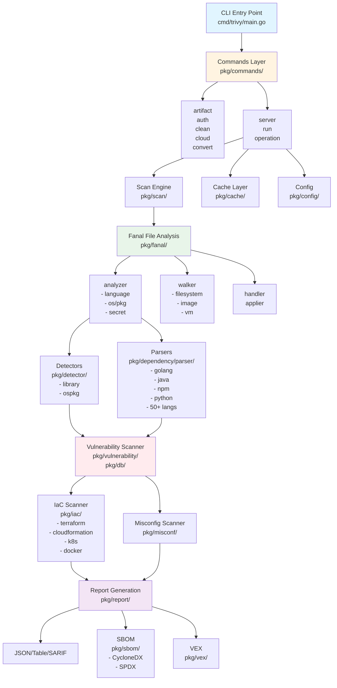
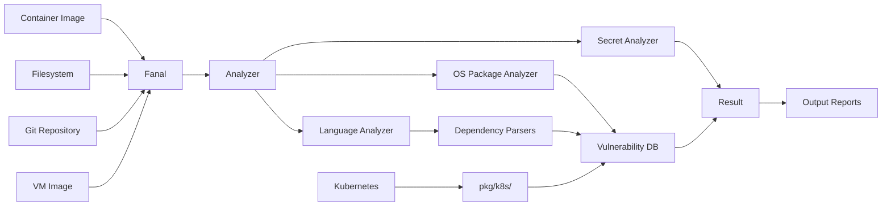
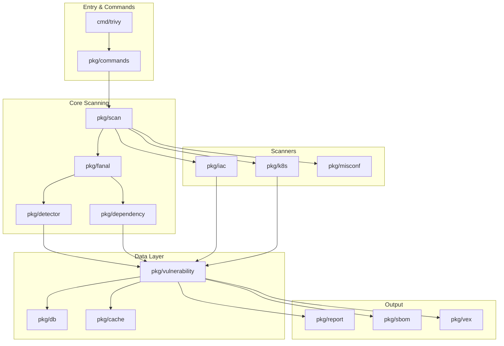

# Trivy コード構成図

このドキュメントはTrivyのコードベースの全体構成を視覚的に示します。

## Mermaid図による全体アーキテクチャ



## スキャンターゲットとフロー



## パッケージ依存関係



## 全体アーキテクチャ

```
┌─────────────────────────────────────────────────────────────────┐
│                         Trivy CLI                                │
│                      (cmd/trivy/main.go)                         │
└──────────────────────────┬──────────────────────────────────────┘
                           │
                           ▼
┌─────────────────────────────────────────────────────────────────┐
│                    Commands Layer                                 │
│                    (pkg/commands/)                                │
│  ┌──────────┬──────────┬──────────┬──────────┬──────────────┐   │
│  │ artifact │   auth   │  clean   │  cloud   │   convert    │   │
│  └──────────┴──────────┴──────────┴──────────┴──────────────┘   │
│  ┌──────────┬──────────┬──────────────────────────────────────┐ │
│  │  server  │   run    │         operation                    │ │
│  └──────────┴──────────┴──────────────────────────────────────┘ │
└──────────────────────────┬──────────────────────────────────────┘
                           │
        ┌──────────────────┼──────────────────┐
        │                  │                  │
        ▼                  ▼                  ▼
┌──────────────┐  ┌──────────────┐  ┌──────────────┐
│ Scan Engine  │  │  Cache Layer │  │ Config Mgmt   │
│ (pkg/scan/)  │  │(pkg/cache/)  │  │(pkg/config/) │
└──────┬───────┘  └──────────────┘  └──────────────┘
       │
       ├──────────────────────────────────────────────┐
       │                                              │
       ▼                                              ▼
┌──────────────────┐                    ┌──────────────────┐
│  Fanal (解析)     │                    │   Scan Targets    │
│ (pkg/fanal/)     │                    │                  │
│                  │                    │  ┌──────────────┐│
│  ┌─────────────┐ │                    │  │  Container   ││
│  │  analyzer   │ │                    │  │   Image      ││
│  │             │ │                    │  └──────────────┘│
│  │ - language  │ │                    │  ┌──────────────┐│
│  │ - os/pkg    │ │                    │  │  Filesystem  ││
│  │ - secret    │ │                    │  └──────────────┘│
│  └─────────────┘ │                    │  ┌──────────────┐│
│                  │                    │  │  Git Repo    ││
│  ┌─────────────┐ │                    │  └──────────────┘│
│  │  walker     │ │                    │  ┌──────────────┐│
│  │             │ │                    │  │  Kubernetes  ││
│  │ - filesystem│ │                    │  └──────────────┘│
│  │ - image     │ │                    │  ┌──────────────┐│
│  │ - vm        │ │                    │  │     VM       ││
│  └─────────────┘ │                    │  └──────────────┘│
│                  │                    └──────────────────┘
│  ┌─────────────┐ │
│  │   handler   │ │
│  └─────────────┘ │
│                  │
│  ┌─────────────┐ │
│  │  applier    │ │
│  └─────────────┘ │
└────────┬─────────┘
         │
         ├──────────────────────────────────────────────┐
         │                                              │
         ▼                                              ▼
┌──────────────────┐                    ┌──────────────────┐
│  Detectors        │                    │  Parsers         │
│(pkg/detector/)    │                    │(pkg/dependency/  │
│                   │                    │ parser/)         │
│ - library/        │                    │                  │
│ - ospkg/          │                    │ - golang         │
└──────────────────┘                    │ - java           │
                                        │ - npm            │
                                        │ - python         │
                                        │ - ruby           │
                                        │ - ... (50+ langs)│
                                        └──────────────────┘
         │
         ▼
┌─────────────────────────────────────────────────────┐
│              Vulnerability Scanner                    │
│          (pkg/vulnerability/, pkg/db/)                │
│  ┌────────────────────────────────────────────────┐  │
│  │ - OS package vulnerabilities                   │  │
│  │ - Library dependencies vulnerabilities        │  │
│  │ - CVE matching                                 │  │
│  └────────────────────────────────────────────────┘  │
└─────────────────────────────────────────────────────┘
         │
         ├──────────────────────────────────────────────┐
         │                                              │
         ▼                                              ▼
┌──────────────────┐                    ┌──────────────────┐
│  IaC Scanner     │                    │  Misconfig Scan  │
│(pkg/iac/)        │                    │(pkg/misconf/)    │
│                  │                    │                  │
│ - terraform      │                    │ - Rego policies  │
│ - cloudformation │                    │ - Config schema  │
│ - k8s            │                    └──────────────────┘
│ - docker         │
│ - helm           │
└──────────────────┘
         │
         ▼
┌─────────────────────────────────────────────────────┐
│              Report Generation                        │
│              (pkg/report/)                            │
│  ┌────────────────────────────────────────────────┐  │
│  │ - JSON, Table, SARIF                          │  │
│  │ - CycloneDX, SPDX (SBOM)                      │  │
│  │ - Template (HTML, JUnit, GitLab, etc.)        │  │
│  └────────────────────────────────────────────────┘  │
└─────────────────────────────────────────────────────┘
         │
         ├──────────────────────────────────────────────┐
         │                                              │
         ▼                                              ▼
┌──────────────────┐                    ┌──────────────────┐
│  SBOM Generator  │                    │  VEX Processor   │
│(pkg/sbom/)       │                    │(pkg/vex/)        │
│                  │                    │                  │
│ - CycloneDX      │                    │ - VEX documents  │
│ - SPDX           │                    │ - Vulnerability  │
│                  │                    │   status         │
└──────────────────┘                    └──────────────────┘
```

## 主要パッケージ構成

### 1. Entry Point
```
cmd/trivy/
└── main.go          # CLIエントリーポイント
```

### 2. Commands Layer
```
pkg/commands/
├── app.go              # アプリケーション初期化
├── run.go              # メイン実行ロジック
├── artifact/           # アーティファクトスキャンコマンド
├── auth/               # 認証コマンド
├── clean/              # キャッシュクリーンアップ
├── cloud/              # クラウド連携
├── convert/            # フォーマット変換
├── server/             # サーバーモード
└── operation/          # 操作管理
```

### 3. Core Scanning Components

#### Fanal (File Analysis)
```
pkg/fanal/
├── analyzer/           # アナライザー（ファイル解析）
│   ├── language/       # プログラミング言語解析
│   ├── os/             # OSパッケージ解析
│   └── secret/         # シークレット検出
├── walker/             # ファイルシステムウォーカー
├── image/              # コンテナイメージ解析
├── vm/                 # VMイメージ解析
├── artifact/           # アーティファクト処理
├── applier/            # レイヤー適用
└── handler/            # イベントハンドラー
```

#### Detectors & Parsers
```
pkg/detector/
├── library/            # ライブラリ検出
└── ospkg/              # OSパッケージ検出

pkg/dependency/
└── parser/             # 依存関係パーサー
    ├── golang/
    ├── java/
    ├── npm/
    ├── python/
    └── ... (50+ languages)
```

### 4. Scanners

```
pkg/iac/                # Infrastructure as Code
├── scanners/           # 各種IaCスキャナー
│   ├── terraform/
│   ├── cloudformation/
│   ├── kubernetes/
│   ├── docker/
│   └── helm/
├── adapters/           # IaCアダプター
├── providers/          # クラウドプロバイダー
└── rego/               # Regoポリシー

pkg/k8s/                # Kubernetes専用スキャナー
├── scanner/
├── report/
└── commands/

pkg/misconf/            # 設定ミス検出
└── scanner/
```

### 5. Data & Storage

```
pkg/db/                 # 脆弱性データベース管理
pkg/cache/              # キャッシュ実装
├── fs.go               # ファイルシステムキャッシュ
├── redis.go            # Redisキャッシュ
└── memory.go           # メモリキャッシュ

pkg/javadb/             # Java DBクライアント
```

### 6. Output & Reporting

```
pkg/report/             # レポート生成
├── table/              # テーブル表示
├── json.go             # JSON出力
├── sarif.go            # SARIF形式
├── template.go         # テンプレート出力
├── cyclonedx/          # CycloneDX形式
└── spdx/               # SPDX形式

pkg/sbom/               # SBOM生成
├── cyclonedx/          # CycloneDX SBOM
├── spdx/               # SPDX SBOM
└── io/                 # SBOM I/O

pkg/vex/                # VEX処理
```

### 7. Infrastructure

```
pkg/rpc/                # RPCサーバー/クライアント
├── server/             # RPCサーバー
└── client/             # RPCクライアント

pkg/plugin/             # プラグインシステム
pkg/module/             # モジュールシステム
pkg/notification/       # 通知機能
pkg/compliance/         # コンプライアンス
pkg/licensing/          # ライセンス検出
pkg/scan/               # スキャン実行制御
```

### 8. Utilities

```
pkg/types/              # 型定義
pkg/flag/               # コマンドライン flags
pkg/log/                # ロギング
pkg/x/                  # 拡張機能
pkg/utils/              # ユーティリティ
```

## データフロー

```
1. CLI入力
   └─> cmd/trivy/main.go

2. コマンド解析・実行
   └─> pkg/commands/run.go

3. ターゲット検出・解析
   ├─> pkg/fanal/ (イメージ/FS/VM/Git解析)
   └─> pkg/dependency/parser/ (依存関係解析)

4. 脆弱性/問題検出
   ├─> pkg/vulnerability/ (CVEマッチング)
   ├─> pkg/iac/ (IaC問題)
   ├─> pkg/misconf/ (設定ミス)
   └─> pkg/fanal/secret/ (シークレット)

5. 結果集約
   └─> pkg/report/ (レポート生成)

6. 出力
   ├─> 標準出力 (テーブル/JSON/SARIF)
   ├─> ファイル出力
   └─> SBOM生成
```

## RPC/Server モード

```
rpc/                    # Protocol Buffers定義
├── cache/
├── common/
└── scanner/

pkg/rpc/
├── server/             # gRPCサーバー実装
└── client/             # gRPCクライアント
```

## テスト・開発支援

```
integration/            # 統合テスト
e2e/                    # エンドツーエンドテスト
internal/               # 内部テストユーティリティ
├── testutil/
├── cachetest/
└── dbtest/
```

